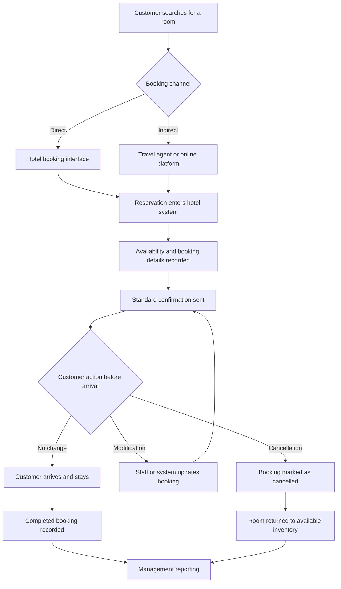

# AS-IS Reservation and Cancellation Process

## Purpose

This document presents a hypothesised current-state reservation process based on the available dataset and a typical hotel booking journey. It is not a verified representation of either hotel's actual operations. In a live project, the process would be validated through stakeholder interviews, staff observation, document review and a process-mapping workshop.

## Assumed Current Process

## Assumed Process Description

1. A customer searches for accommodation and selects a room.
2. The booking is created directly with the hotel or through an intermediary.
3. The reservation enters the hotel's reservation or property-management system.
4. Availability, dates, customer details and booking conditions are recorded.
5. A standard confirmation is issued.
6. Before arrival, the customer may keep, modify or cancel the reservation.
7. Staff update the booking where manual intervention is required.
8. Cancelled inventory is returned for potential resale.
9. Completed and cancelled bookings contribute to management reporting.

## Potential Pain Points

The following are hypotheses derived from the data and assumed process. They are not confirmed operational findings.

| ID | Potential Pain Point | Possible Business Effect | Evidence or Validation Required |
|---|---|---|---|
| PP01 | All bookings may receive similar confirmation treatment regardless of cancellation characteristics | Staff effort may not be directed towards reservations with greater potential exposure | Review confirmation rules and interview reservations staff |
| PP02 | Long-lead-time bookings may not receive additional confirmation closer to arrival | Changes in customer intentions may remain unidentified until cancellation | Review reminder schedules and cancellation timing |
| PP03 | Group bookings may require different handling from individual bookings | High-volume cancellations could create sudden inventory and revenue-planning changes | Interview group-booking staff and review contract terms |
| PP04 | Information may arrive through multiple distribution channels | Delayed or inconsistent updates could affect room availability and reporting | Review channel integrations, timestamps and exception logs |
| PP05 | Cancellation reporting may focus on rates without considering booking value | Operational attention may not reflect the size of potential exposure | Validate financial measures with revenue and finance stakeholders |
| PP06 | Staff may lack a single view of bookings requiring attention | Manual monitoring could be inconsistent and time-consuming | Observe staff workflow and review current system functionality |
| PP07 | Cancellation policies may be applied too broadly | Stronger controls could discourage reliable or valuable customers | Review policies, conversion data and customer feedback |
| PP08 | Current reporting may describe outcomes after they occur | Managers may have limited opportunity for earlier intervention | Review dashboards, reports and decision timelines |

## Evidence from the Historical Data

The dashboard provides initial evidence that the cancellation problem is not distributed evenly:

- The overall historical cancellation rate was 37.04%.
- The City Hotel had a higher cancellation rate than the Resort Hotel.
- Bookings made more than 180 days before arrival had a substantially higher cancellation rate than bookings made within seven days.
- Group bookings had a high historical cancellation rate.
- Bookings with no special requests were associated with a higher cancellation rate.
- Potential booking-value exposure varied across booking and customer characteristics.

These findings help prioritise discovery questions, but they do not confirm why customers cancelled or prove that a specific process change would prevent cancellation.

## Information Gaps

The dataset does not establish:

- Whether reservation_status_date consistently represents the operational cancellation timestamp and whether confirmation or reminder activity occurred before cancellation.
- Whether a customer received or responded to a confirmation reminder.
- Whether deposits or cancellation charges were collected.
- Whether cancelled rooms were subsequently resold.
- How much staff time was spent monitoring reservations.
- Whether channel updates were delayed.
- Why individual customers cancelled.
- Whether different customer groups received different booking terms.
- The effect of cancellation policies on booking conversion.
- Customer satisfaction with the existing reservation process.

## Validation Questions

### Questions for the Reservations Manager

- What happens from the moment a booking enters the system?
- Which booking channels require manual intervention?
- How and when are customers asked to confirm their reservations?
- Which bookings currently receive additional attention?
- What are the most common exceptions or operational problems?
- At what stage do staff normally learn that a booking will not proceed?

### Questions for Reservations Staff

- Which parts of the process require manual work?
- How do you decide which customers to contact?
- What information is difficult to locate or verify?
- Where do delays, errors or duplicate activities occur?
- What would make the process easier without creating unnecessary alerts?

### Questions for Revenue and Finance Teams

- How are cancellations incorporated into occupancy and revenue forecasts?
- How is lost or displaced booking value calculated?
- Can cancelled rooms be connected to subsequent replacement bookings?
- Which cancellation measures currently inform decisions?
- What financial definition should be used during a pilot?

### Questions for IT or the System Provider

- Which booking events and timestamps are stored?
- Can the system support configurable confirmation rules?
- Can it integrate information from direct and indirect booking channels?
- Can authorised staff view and update a prioritised work queue?
- What security, access and data-retention controls already exist?

## Current-State Risks

- Decisions could be based on historical associations that no longer represent current behaviour.
- An unverified process map could omit important manual activities or system controls.
- Potential booking value could be misinterpreted as confirmed financial loss.
- Excessive customer contact could reduce satisfaction.
- Broad deposit policies could reduce bookings as well as cancellations.
- Use of customer information could create privacy or fairness concerns.

## Validation Outcome Required

Before progressing to detailed solution design, the project team should agree:

- The verified current-state process.
- The principal operational pain points.
- Which findings represent genuine business problems.
- The causes requiring further investigation.
- The baseline KPIs.
- The project scope and decision-making authority.
