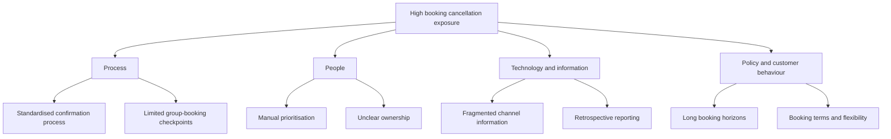

# Data Findings and Root-Cause Analysis

## Purpose

This analysis connects the historical dashboard findings to potential operational causes requiring further investigation. Confirmed data observations are separated from hypotheses because the dataset identifies patterns but does not explain why individual customers cancelled.

## Analytical Summary

The dataset contains 119,390 historical bookings from a city hotel and a resort hotel in Portugal. Of these bookings, 44,224 were cancelled and 75,166 were completed, producing an overall cancellation rate of 37.04%.

The analysis indicates that cancellation behaviour differed substantially across hotels, lead-time groups, market segments and customer-engagement characteristics. These differences can help prioritise discovery activities and possible process improvements.

## Evidence Register

| ID | Confirmed Historical Finding | Initial Business Interpretation | What the Finding Does Not Prove |
|---|---|---|---|
| DF01 | The overall cancellation rate was 37.04% | Cancellations represent a material operational issue in the historical data | That the same rate applies to current hotel operations |
| DF02 | City Hotel cancellation rate was 41.73%, compared with 27.76% for Resort Hotel | Hotel type, customer mix, channel mix or operating practices may influence cancellation exposure | That being a city hotel directly causes cancellation |
| DF03 | Bookings made more than 180 days before arrival had a 57.01% cancellation rate | Long booking horizons may create greater uncertainty and may justify additional confirmation activity | That reminders or deposits would necessarily prevent these cancellations |
| DF04 | Bookings made within seven days of arrival had a 9.63% cancellation rate | Short-lead bookings were historically more likely to proceed | That all short-lead bookings should be treated as low risk |
| DF05 | Group bookings had a 61.06% cancellation rate | Group-booking processes and terms should be investigated | That group size itself caused cancellation |
| DF06 | Direct bookings had a 15.34% cancellation rate | Direct customer relationships may provide stronger engagement or different booking conditions | That shifting all customers to direct channels would reproduce this outcome |
| DF07 | Bookings with no special requests had a 47.72% cancellation rate | Customer engagement indicators may help prioritise follow-up | That creating a special request would reduce cancellation |
| DF08 | Potential booking value at risk was estimated at 16.73 million currency units | Cancellation analysis should consider booking value as well as cancellation frequency | That 16.73 million represents confirmed lost revenue |

## Problem Definition

The historical evidence suggests that the organisation may be treating bookings with substantially different cancellation characteristics through a broadly similar reservation-monitoring process.

The underlying problem is not simply that customers cancel. The potential process problem is that the organisation may lack:

- A consistent method for identifying bookings requiring attention.
- Timely confirmation activities based on booking characteristics.
- A consolidated operational view of cancellation exposure.
- Agreed measures connecting cancellation patterns to business value.
- A controlled method for testing whether interventions improve outcomes.

These are hypotheses to be validated during discovery.

## Root-Cause Hypothesis Categories

| Category | Potential Cause | Why It Is Plausible | Evidence Required |
|---|---|---|---|
| Process | Confirmation activities may not vary according to booking characteristics | Cancellation rates differ substantially by lead time and segment | Current procedures, reminder schedules and staff interviews |
| Process | Group reservations may require more structured checkpoints | Group bookings have a high historical cancellation rate | Group-booking workflow, contracts and cancellation timing |
| People | Staff may rely on individual judgement when prioritising follow-up | No operational risk-prioritisation process is represented in the available project information | Staff observation and interviews |
| Technology | Reservation information may be fragmented across booking channels | The dataset includes multiple market segments and distribution channels | System architecture, integration logs and exception reports |
| Information | Existing reports may be retrospective rather than actionable | The current dashboard analyses completed historical outcomes | Review of operational reports and decision timelines |
| Policy | Booking and deposit terms may not reflect differences in cancellation exposure | Cancellation rates differ across booking characteristics | Policy comparison, conversion rates and customer feedback |
| Customer | Customers booking far in advance may experience changing circumstances | Long-lead bookings show higher cancellation rates | Cancellation reasons, customer research and cancellation timing |
| Measurement | Potential exposure may be treated as confirmed loss | The available revenue measure does not account for room resale or charges | Finance definitions and replacement-booking data |
| Governance | Ownership of cancellation reduction may be unclear | The issue affects reservations, revenue, finance, marketing and IT | Responsibility mapping and stakeholder interviews |

## Cause-and-Effect View

## Five Whys Exploration

The following is an exploratory exercise rather than a confirmed causal chain.

**Problem:** Management has limited ability to respond proactively to cancellation exposure.

1. **Why?** Potentially vulnerable reservations may not be identified early enough.
2. **Why?** Bookings may not be categorised according to relevant cancellation characteristics.
3. **Why?** Reservation data may primarily support transaction processing and retrospective reporting.
4. **Why?** Operational rules and reporting requirements may not have been designed around proactive cancellation monitoring.
5. **Why?** Ownership, success measures and intervention processes may not have been formally defined across reservations, revenue management, finance and IT.

This hypothesis would need to be tested against the verified current-state process.

## Controllable and Non-Controllable Factors

### Potentially Controllable

- Timing and content of confirmation reminders
- Staff follow-up procedures
- Visibility of bookings requiring attention
- Reporting frequency and dashboard design
- Group-booking checkpoints
- Deposit and cancellation-policy design
- Staff training and process ownership

### Not Directly Controllable

- Customers' personal circumstances
- External travel disruption
- Changes in destination demand
- Macroeconomic conditions
- Behaviour of external booking platforms
- The time between booking and the intended arrival date

The proposed solution should focus on factors the organisation can influence while monitoring external factors.

## Discovery Priorities

Based on business importance and uncertainty, discovery should initially prioritise:

1. Verification of the current confirmation and cancellation process.
2. Investigation of long-lead-time and group-booking journeys.
3. Identification of existing manual work and system limitations.
4. Validation of cancellation and financial definitions.
5. Collection of cancellation timing and reason data.
6. Assessment of customer and conversion effects.
7. Agreement on a limited pilot and baseline KPIs.

## Preliminary Conclusion

The data supports further investigation of a risk-based reservation-monitoring process, but it does not justify immediate implementation of stricter policies. Before selecting a solution, the organisation should validate the current process, investigate cancellation reasons and assess the operational and customer effects of possible interventions.
