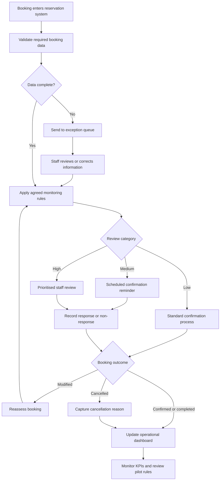

# Gap Analysis and TO-BE Process

## Purpose

This document compares the hypothesised current reservation-monitoring process with the capabilities required for a more structured future process. The future state is a proposed design for a limited pilot and would require stakeholder, technical, legal and operational validation.

## Target Business Outcome

The proposed future state aims to help hotel staff identify reservations that may benefit from timely confirmation or review, while avoiding automatic rejection, cancellation or unfair treatment of customers.

The proposal is not a production predictive model. The initial pilot would use transparent business rules agreed with stakeholders and informed by historical patterns.

## Gap Analysis

| ID | Current-State Assumption | Required Future Capability | Identified Gap | Proposed Response |
|---|---|---|---|---|
| GA01 | Bookings may receive broadly similar confirmation treatment | Confirmation activity should reflect agreed operational indicators | No structured method for prioritising reservations | Introduce transparent low, medium and high review categories |
| GA02 | Staff may manually identify bookings requiring attention | Staff should have a consistent prioritised work queue | Monitoring may depend on individual judgement | Provide a central reservation-review queue |
| GA03 | Confirmation activity may occur at a standard point | Reminders should be triggered at appropriate stages before arrival | Timing may not reflect long booking lead times | Introduce configurable confirmation checkpoints |
| GA04 | Group bookings may follow the general reservation process | Group reservations may require additional validation stages | Group-specific risks may not be addressed consistently | Design a separate group-booking confirmation path |
| GA05 | Booking information is received through different channels | Relevant booking information should be visible consistently | Channel information may be fragmented or delayed | Define minimum data and integration requirements |
| GA06 | Reporting may focus on completed historical outcomes | Managers need timely operational indicators | Limited support for proactive intervention | Create an operational monitoring dashboard |
| GA07 | Cancellation rates may be viewed separately from booking value | Decisions should consider both frequency and potential exposure | Prioritisation may not reflect business value | Include validated value-exposure measures |
| GA08 | Cancellation reasons may not be consistently captured | The organisation should understand why customers cancel | Root causes cannot be confirmed from current data | Add structured cancellation-reason capture |
| GA09 | Outcomes of staff follow-up may not be recorded centrally | Pilot effectiveness should be measurable | Limited traceability between intervention and outcome | Record contact activity and customer response |
| GA10 | Success criteria may not be formally agreed | The pilot should have baseline measures and decision rules | Benefits cannot be evaluated consistently | Define KPIs, pilot duration and review criteria |
| GA11 | Customer and privacy effects may not be measured | The process must remain proportionate and acceptable | Operational improvements could create customer or compliance risks | Include privacy review, complaints and opt-out monitoring |
| GA12 | Ownership may be shared across several teams | Roles and decision rights should be clear | Accountability may be fragmented | Agree process ownership and escalation responsibilities |

## Proposed Future-State Principles

The future process should be:

- **Transparent:** staff should understand why a booking requires attention.
- **Proportionate:** intervention should match the level of operational concern.
- **Human reviewed:** the system should support staff decisions rather than automatically cancelling bookings.
- **Measurable:** each intervention and outcome should be recorded.
- **Configurable:** authorised managers should be able to revise rules following pilot evidence.
- **Privacy conscious:** only necessary information should be used and retained.
- **Customer focused:** communications should be clear and should not create unnecessary inconvenience.

## Proposed TO-BE Process

## Proposed Process Description

### 1. Booking receipt and validation

A booking enters the reservation system through a direct or indirect channel. The system checks that the minimum information required for monitoring is present.

Incomplete or inconsistent records enter an exception queue for staff review.

### 2. Application of monitoring rules

Complete bookings are assessed using transparent rules approved for the pilot. Possible indicators could include:

- Booking lead-time category
- Hotel type
- Market segment
- Distribution channel
- Customer type
- Group status
- Number of previous cancellations
- Deposit type
- Number of booking changes
- Presence of special requests

The final rules should be approved by operational, technical and compliance stakeholders. Historical association alone should not determine customer treatment.

### 3. Review categorisation

Bookings are assigned to an operational category:

- **Low:** standard confirmation process
- **Medium:** scheduled confirmation reminder
- **High:** prioritised staff review

The category indicates the level of review required. It should not be described to customers as a personal risk score.

### 4. Confirmation and staff review

Medium-category bookings receive an appropriately timed reminder. High-category bookings appear in a prioritised work queue for reservations staff.

Staff can review the relevant booking information, contact the customer where appropriate and record the outcome.

### 5. Reassessment

A material booking modification may cause the monitoring rules to be applied again. This ensures the operational category reflects the latest available booking information.

### 6. Outcome capture

The process records whether the booking was:

- Confirmed
- Modified
- Cancelled
- Completed
- Not resolved following attempted contact

Where possible, a structured cancellation reason is captured without requiring unnecessary personal information.

### 7. Monitoring and review

The operational dashboard reports pilot activity and outcomes. Management periodically reviews:

- Whether interventions were completed
- Whether confirmation outcomes improved
- Whether staff workload remained manageable
- Whether complaints or negative customer effects increased
- Whether individual rules remained useful and proportionate

## Initial Business Rules for Pilot Discussion

The following are examples for stakeholder discussion, not final requirements:

| Rule | Proposed Action | Reason for Testing |
|---|---|---|
| Booking made more than 180 days before arrival | Schedule an additional confirmation checkpoint closer to arrival | This category had a high historical cancellation rate |
| Group booking | Add a group-specific review checkpoint | Group bookings had a high historical cancellation rate |
| Long-lead City Hotel booking | Prioritise according to agreed value and timing conditions | City Hotel and long-lead bookings showed greater historical exposure |
| Booking with incomplete required information | Route to an exception queue | Missing information may prevent reliable processing |
| Booking materially modified | Reapply the monitoring rules | Updated conditions may affect the required operational action |

No rule should automatically cancel a reservation or impose a new charge without separate policy approval.

## Proposed Pilot

### Pilot Scope

- One hotel or one selected booking channel
- Limited implementation period
- Transparent rules rather than a complex predictive model
- Human review before customer contact
- Agreed maximum workload for reservations staff
- Baseline and post-pilot measurement

### Pilot Stages

1. Validate the current process and baseline measures.
2. Agree the rules and customer communications.
3. Configure a prototype work queue and dashboard.
4. Train participating reservations staff.
5. Conduct UAT.
6. Run the limited pilot.
7. Review operational, financial and customer outcomes.
8. Refine, expand or discontinue the process.

## Expected Benefits

- More consistent reservation monitoring
- Better prioritisation of staff effort
- Earlier visibility of possible cancellations
- Improved cancellation-reason information
- More reliable operational reporting
- Better evidence for future policy decisions

## Key Trade-Offs

- Additional confirmation may reduce uncertainty but could inconvenience customers.
- More detailed monitoring may improve prioritisation but increase staff workload.
- Stricter booking conditions may reduce cancellation but also reduce conversion.
- More customer data may improve analysis but create privacy and governance concerns.
- Simple rules are explainable but may overlook complex interactions.
- A complex model may improve classification but reduce transparency and require stronger validation.

## Future-State Validation

Before approval, stakeholders should confirm:

- Whether the proposed process fits existing hotel operations
- Whether the required data is available and sufficiently reliable
- Whether reminder and review activities are operationally feasible
- Whether customer communications are appropriate
- Whether privacy and security controls are sufficient
- Whether the proposed KPIs can be measured
- Whether the pilot has clear ownership and decision criteria
